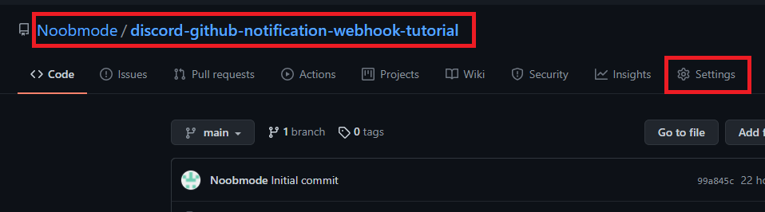
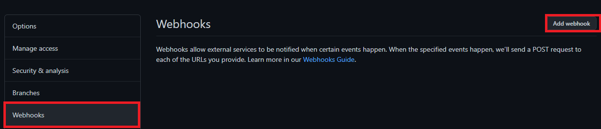
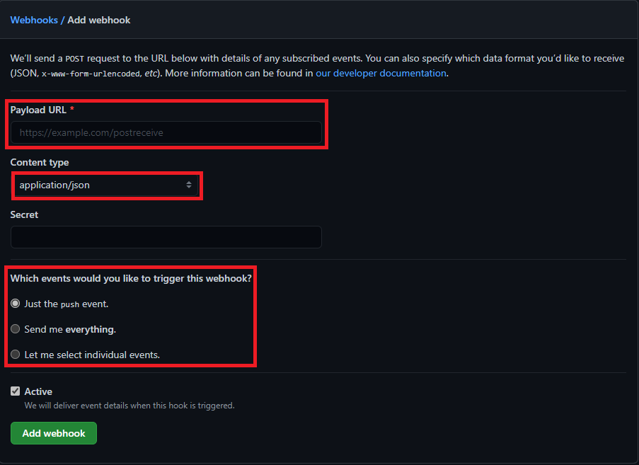
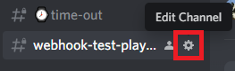
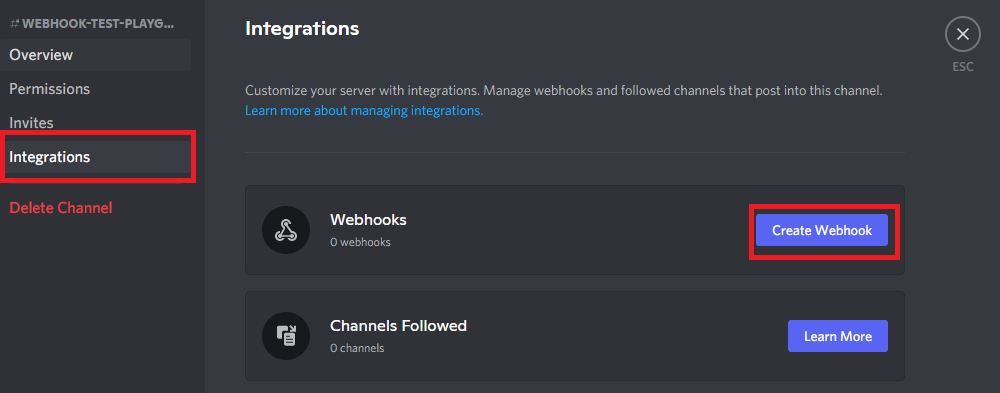
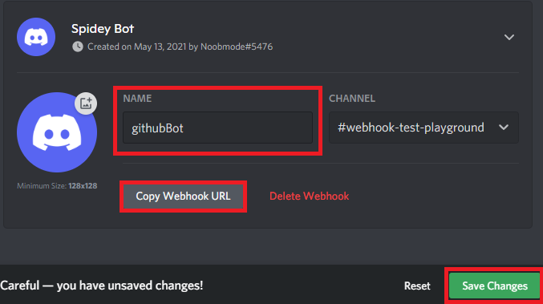
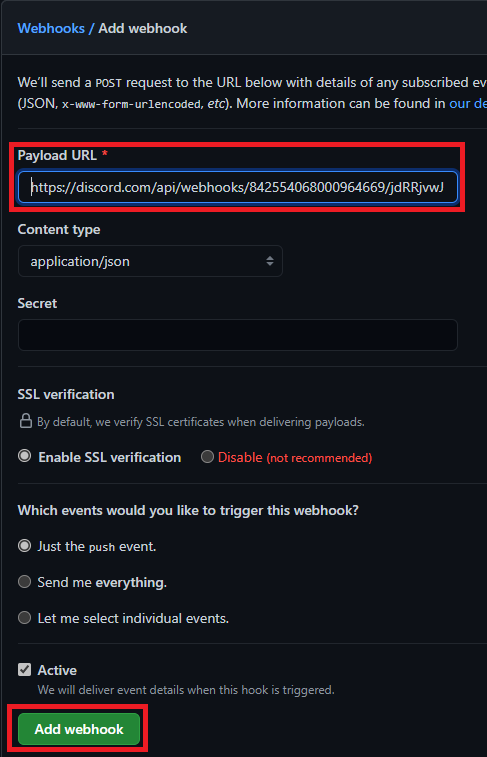
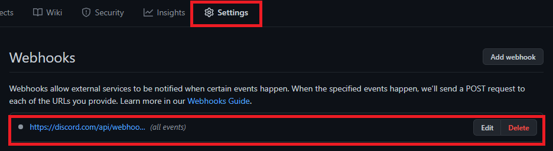
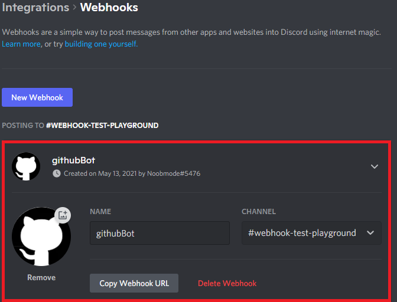
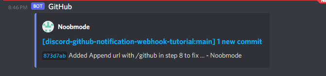

# discord-github-notification-webhook-tutorial
## Overview
Instructions and walk through for setting up a webhook in discord for github notifications

## Challenge
A notification system is needed in a discord channel for keeping all channel/team members in the loop regarding changes to a target repository. 

## Solution
1. You will need to have permissions in the desired Discord channel and access to the Github repository.
   
2. Navigate to the GitHub repository you want notifications for and go to the settings page

3. Select "Webhooks" from the left menu panel, click the "Add Webhook" button on the right side

4. You will need the "Payload URL" from Discord, explained in the next steps, the "Content type" set to "application/json", and which events you wish to receive 

5. To retrieve the "Payload URL", choose your desired "Channel" in Discord. Click the "Gear" to the right of the channel name to enter the "Settings" blade.

6. Select the "Integrations" option, on the "Integrations" blade click "Create Webhook"

7. Name the bot accordingly, hit "Copy Webhook URL", and "Save Changes". Notice the bottom left shows I have not saved in the screen shot.
   

8. Paste the copied URL from step 7 into the GitHub webhook page from step 3. **Make sure you append "/github" to the end of the Discord hook URL or you will get a 400 response error in the Github wekhook page**. Check your settings. Hit "Add Webhook".
   

9. You should now see in Github and Discord the Webhook and bot like the screen shots below

10. Now when you meet the event requirements for the webhook, you should receive the notification in discord.

11. Enjoy your notifications via a webhook!